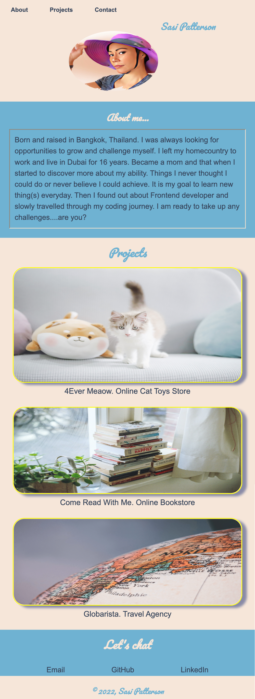
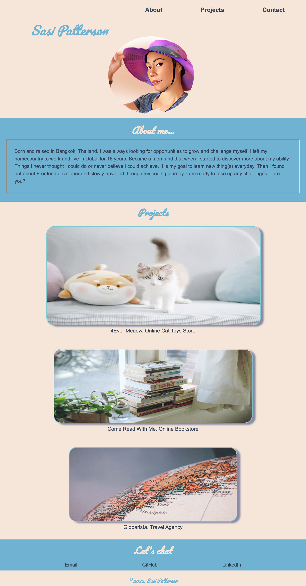
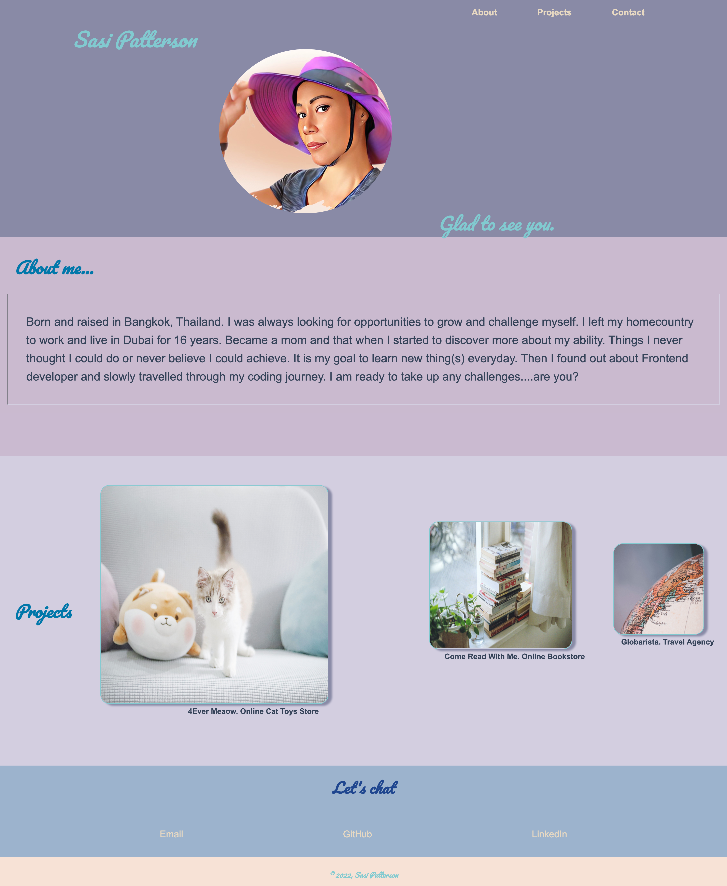

# Portfolio
Responsive Portfolio Website.

## Table of Contents
1. Description 
2. Visuals
3. Link to the deployed website

## Description
Getting a job is about being proactive. To be ahead of the game, your resume and cover letter should be prepared way before you are ready to look for a job. As a web developer your portfolio website is your resume. It shows your personality, your work style, your creativity and your skills. You can keep adding new projects or modifying your website to reflect your strength as you learn new skills. This is an example of a simple responsive porfolio website that can help you connect to your potential employer. It is created using mobile first approach. As I found it is easier to add media queries for bigger screens after the mobile version is completed. 

Visuals
```bash
Portfolio Mobile Version. 
```


```bash
Portfolio Tablet Version for screen 768px upto 991px.
```


```bash
Portfolio Laptop/Desktop Version for screen 992px and up.
```


## Website
Sasima Patterson's Portfolio Website

[Portfolio URL](https://sasimapatterson.github.io/simple-portfolio/)

